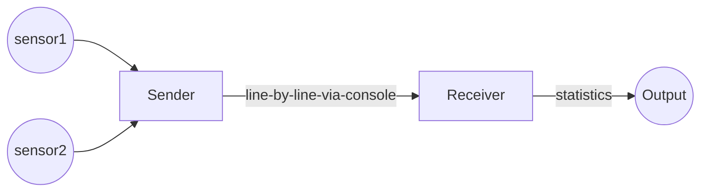
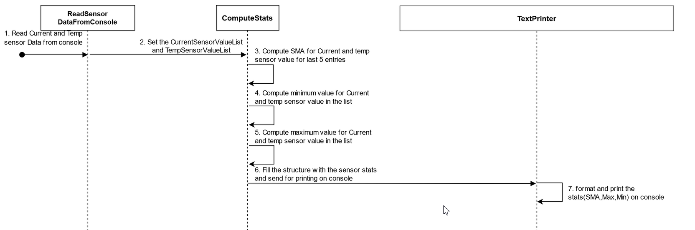

# Streaming BMS Data

This project is about sending and receiving BMS data.

## Decomposition

At a top level, the program runs in two processes - the sender and the receiver.

The Sender simulates and processes data from sensors. It sends data line-by-line to the console, in a format that it defines.
The Receiver inputs this data and computes statistics.

The Sender sends data to the Receiver using [console redirection and pipes](https://ss64.com/nt/syntax-redirection.html).
They need to run on the command-line as follows:

`sender-executable | receiver-executable`

This would make the console-writes of the sender
become the console-reads of the receiver.
It gives us the flexibility of decoupling the sender and receiver -
they can even be written in different languages.

## Phases

The project is divided into two phases:

- Develop the Sender in the first phase, complete with test cases. The syntax and meaning of the data must be evident by reading your test cases.
Do not develop the Receiver yet.

We will instruct you to handover your Sender to another participant and take-over another Sender.

- Develop the Receiver for the Sender you take-over.

## The Interface

We document the interface between the Sender and the Receiver as test cases.

The Sender and Receiver are testable on their own:

- The Sender is testable without the Receiver - so we can develop
for another sensor, test and be confident about integration.
- The Receiver is testable without the Sender - so we can enhance with additional statistics,
without re-testing against all Senders again.

## Decomposition of responsibility

The naming of source files within the Sender and within the Receiver
give their internal decomposition.

## Minimum Functionality

This section lists the minimum functionality of the Sender and Receiver.

### The Sender

- simulates and sends at least two Battery / Charging parameters
- sends fifty readings in a stream
- can either generate values for the parameters, or read from a file
- uses console output to communicate the parameters.

### The Receiver

- reads the parameters from the console input
- after reading every parameter, it prints the following:
    - maximum and minimum values in the incoming stream
    - [simple moving average](https://www.investopedia.com/terms/s/sma.asp) of the last 5 values

Eg:
The sensor values will be displayed in the console in the format current,temperature

**Input on the console:**

100,60\
30,80\
20,20\
20,30\
45,45\
25,10\
70,70\
30,40\
90,90\
35,50

 **Output**
 
Simple moving average: Current sensor value=50.000000\
Simple moving average: Temperature sensor value=52.000000\
Current sensor minimum value=20\
Temperature sensor minimum value=10\
Current sensor maximum value=100\
Temperature sensor maximum value=90

**Assumptions:**
1. Two sensors: Current and Temperature sensor will generate 10 readings each. The value will be displayed on console in the format: current,temperature.
2. These are read by the reciever and stored in the form of list. These list shouldnot be empty. The values read will be 10.
3. Stats will be computed with the obtained list of values.

**UML diagram:**

**Code flow:**
1. Read the sensor values from sensor output.Sender will display the values on the console.
2. The values read from the console will be stored in the two list: CurrentsensorValueList and TemperatureSensorValueList.
3. If the list is not empty, then the copute the stats for the sensor data.
4. Compute the average for the last 5 readings in the list for current and temperature data.
5. Compute the min and max values in the list for both the data.
6. Print the stats after computation on console.

**Test specification:**
  1. **Test the computation of Simple Moving Average:**
     Sensor value list should be set. Later, compute SMA for the last 5 entries of the list. Verify if the computed average is as expected.\
     Expectation: If the list is {10,30,20,20,45,25,70,30,70,35}, then result should be 46.
  2. **Test the computation of minimum value in the sensor data list:**
     Sensor value list should be set. Later, find the minimum value in the entries of the list. Verify if the computed min value is as expected.\
     Expectation: If the list is {10,30,20,20,45,25,70,30,70,35}, then result should be 10.
  3. **Test the computation of minimum value in the sensor data list where the list contains single element:**
     Sensor value list should be set with single entry. Later, find the minimum value in the entries of the list. Verify if the computed min value is as single element in the list.\
     Expectation: If the list is {35}, then result should be 35.
  4. **Test the computation of maximum value in the sensor data list:**
     Sensor value list should be set. Later, find the maximum value in the entries of the list. Verify if the computed max value is as expected.\
     Expectation: If the list is {10,30,20,20,45,25,70,30,70,35}, then result should be 70.
  5. **Test the computation of maximum value in the sensor data list where the list contains single element:**
     Sensor value list should be set with single entry. Later, find the maximum value in the entries of the list. Verify if the computed max value is as single element in the list.\
     Expectation: If the list is {35}, then result should be 35.
  6. **Test functionality to read Sensor data from Console using mock functionality(Behavioural testing):**
     Mock current and temperature value list.Before generating the sensor statics, sensor values need to be read from console. After creating the mock object, get the sensor data.\
     Expectation: The obtained sensor value should be same as that of sender(mock object).
  7. **Behavioural testing for print functioanlity:**
     Test functionality to print Sensor statistics data using mock functionality.Before generating the sensor statics, sensor values need to be read from console. After creating the mock object, check the print functionality using behavioural testing\
     Expectation: Print functionality should be called 6 times for printing each stats info.
  8. **Test the computation of Simple Moving Average:**
     Test the Sensor Value Statics obtained. Before generating the sensor statics, sensor values need to be read from console and then compute the stats. After computing the stats, verify them.\
     Expectation: If the current Sensor Value List is {100,30,20,20,45,25,70,30,90,35} and temperature Sensor Value List is{60,80,20,30,45,10,70,40,90,50}.\
     Then, the stats obatained are as below:\
     SMA: Current sensor value=50.000000,SMA: Temperature sensor value=52.000000,Current sensor minimum value=20,Temperature sensor minimum value=10,Current sensor maximum value=100,Temperature sensor maximum value=90
     
## Quality Parameters

Setup the quality parameters of your project (duplication, complexity, coverage, warnings) using GitHub workflow yml files.
